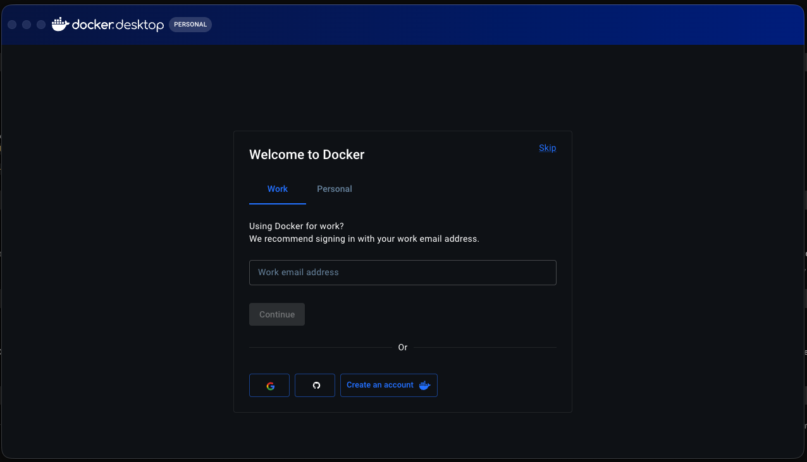
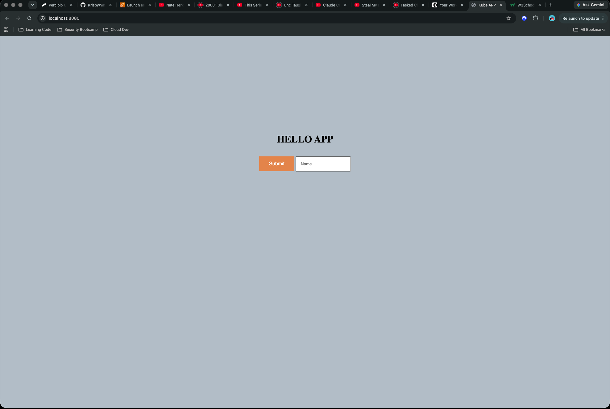
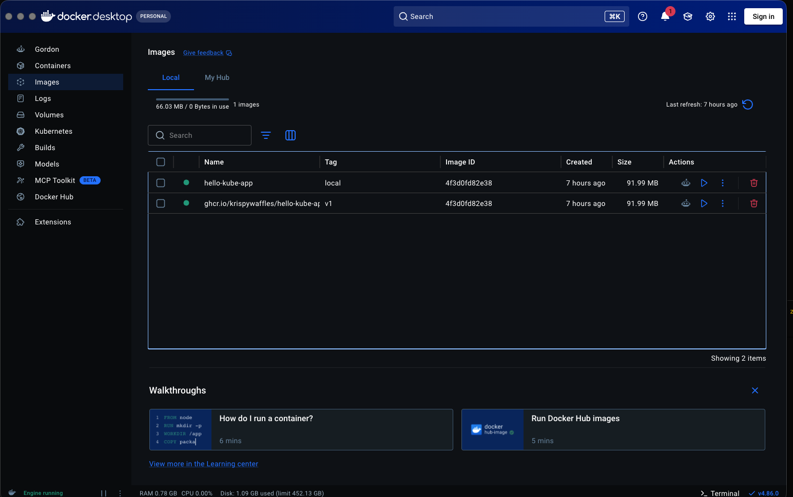
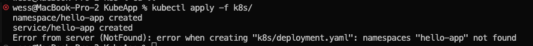
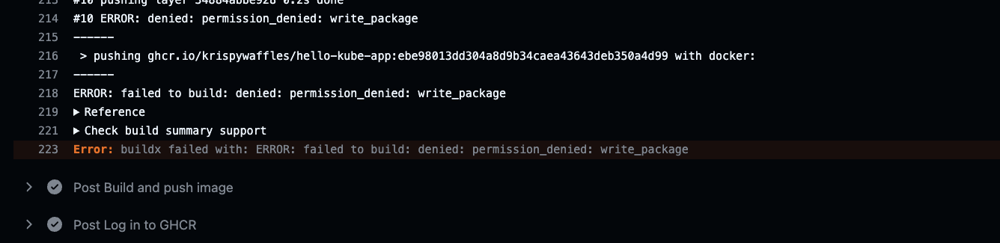
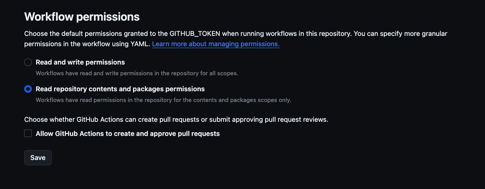
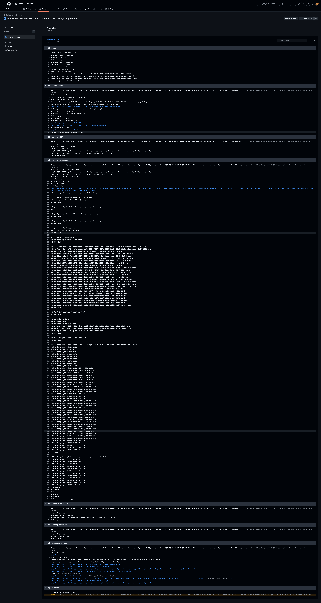
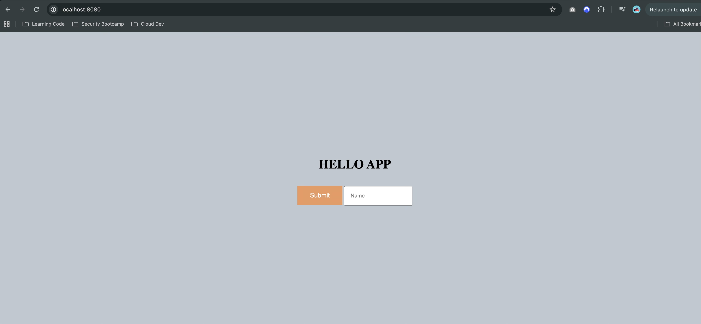
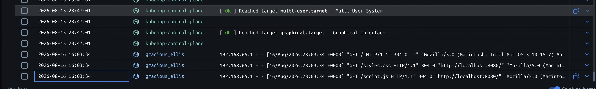

# KubeApp — Hello World on Kubernetes, with a CI/CD Pipeline

A tiny "Hello, [name]!" web app, built from scratch to learn the real mechanics of **Docker**, **Kubernetes**, and **CI/CD** — no frameworks, no shortcuts, everything run and debugged by hand at least once before automating it.

This project is AWS/cloud learning project #2. The goal wasn't really the app itself (it's intentionally simple) — it was to actually *see* something running live at every stage, and to build real confidence with the tools that show up in a cloud/DevOps job, not just read about them.

**Live technically anywhere it's checked out**: the app itself only runs locally (on a laptop, via a free local Kubernetes cluster) — nothing here costs money or requires an AWS account. See [Stretch Goals](#stretch-goals) for what a real cloud (AWS EKS) version would add.

---

## Glossary

Terms are defined here, once, in plain language — refer back to this section any time something below is unfamiliar.

| Term | Meaning |
|---|---|
| **Docker** | A tool for packaging an application together with everything it needs to run, so it behaves identically anywhere. |
| **Image** | A static, non-running snapshot of an application — like a recipe or blueprint. Doing nothing until someone runs it. |
| **Container** | A live, running instance of an image. One image can be run many times, producing many independent containers. |
| **Dockerfile** | A text file with instructions for building an image (what to start from, what files to add, etc). |
| **Container registry** | Cloud storage specifically for Docker images, so they can be pulled down and run somewhere other than the machine that built them. |
| **GHCR** | GitHub Container Registry (`ghcr.io`) — the specific registry we used, because it's free and built into GitHub. |
| **PAT** | Personal Access Token — a password-like credential for tools/scripts to prove "this is really you," scoped to only the permissions it needs. |
| **Kubernetes (K8s)** | A system for running containers reliably across one or more machines — automatically restarting crashed containers, routing traffic, scaling, etc. ("K8s" = "K" + 8 letters + "s" = *Kubernetes*.) |
| **Cluster** | A set of machines (real or virtual) working together, managed by Kubernetes. |
| **Node** | One machine (real or virtual) that's part of a cluster. |
| **kind** | "Kubernetes IN Docker" — a tool that creates a real, small Kubernetes cluster using Docker containers as its nodes, entirely on a laptop, for free. |
| **kubectl** | The command-line tool used to send instructions to any Kubernetes cluster (pronounced "kube-control" / "kube-C-T-L"). |
| **Pod** | The smallest unit Kubernetes runs — one live instance of a container, managed by Kubernetes instead of run directly by a person. |
| **Deployment** | A Kubernetes object that says "always keep N Pods of this container running," automatically replacing any that crash or get updated. |
| **Service** | A stable network address that routes traffic to whichever Pods are currently healthy, even as individual Pods get replaced and their addresses change. |
| **Namespace** | A way to group related Kubernetes resources together, like a folder. |
| **YAML** | A plain-text format (`.yaml` files) used to describe configuration — what we use to describe Namespaces, Deployments, and Services to Kubernetes. |
| **CLI** | Command-Line Interface — a tool you operate by typing commands (as opposed to clicking a GUI). |
| **CI/CD** | Continuous Integration / Continuous Deployment — automatically building (and ideally deploying) code every time it changes, instead of doing it by hand each time. |
| **GitHub Actions** | GitHub's built-in automation service — runs jobs (build, test, deploy, etc.) on temporary cloud machines, triggered by events like a push. |
| **Workflow** | A YAML file (in `.github/workflows/`) that tells GitHub Actions when to run and what to do. |
| **`GITHUB_TOKEN`** | A temporary credential GitHub automatically generates fresh for every workflow run — separate from a personal PAT, and used so the pipeline doesn't need anyone's personal credentials. |
| **Commit SHA** | A unique ID (long string of letters/numbers) Git assigns to every commit — used here to tag each built image uniquely and traceably. |
| **Rolling update** | Kubernetes' method of updating a Deployment: new Pods (new version) are started before old Pods (old version) are shut down, so the app stays available throughout. |
| **`port-forward`** | A temporary tunnel from a port on your own machine to something running inside the cluster, so you can reach it from a browser. |
| **nginx** | A widely-used, lightweight web server — what actually serves our HTML/CSS/JS files inside the container. |
| **EKS** | Elastic Kubernetes Service — AWS's managed, real-cloud version of Kubernetes (a paid stretch goal for this project, not used yet). |

---

## Architecture — the full picture

```
Your laptop                                   GitHub (cloud)
┌─────────────────────────┐                  ┌──────────────────────────┐
│  app/ (HTML/CSS/JS)      │  git push        │  GitHub Actions          │
│  Dockerfile              │ ───────────────► │  (builds image on every  │
│                          │                  │   push to main)          │
│  kind cluster            │                  │        │                │
│   └─ hello-app Pods  ◄───┼──────────────────┼────────┘ pushes image to │
│       (nginx + app)      │  kubectl pulls   │                          │
│                          │  new image        │  GHCR (ghcr.io)         │
│  kubectl port-forward    │                  │  hello-kube-app:<tag>    │
│       │                  │                  │  (public — anyone can    │
│       ▼                  │                  │   pull, no login)        │
│  localhost:8080  ◄── you open this in your browser                     │
└─────────────────────────┘                  └──────────────────────────┘
```

**The key thing this diagram is meant to show**: GitHub Actions only ever builds and stores a new image in GHCR. It never touches the cluster. Getting that new image actually running is a separate, manual step done from the laptop with `kubectl`. See [Phase 5](#phase-5--roll-the-new-image-out-manual-cd) for why.

---

## Phase 0 — Install the tools

**Why**: none of Docker, `kubectl`, or `kind` come pre-installed on a Mac — they're the three tools this whole project depends on.

```
brew install --cask docker      # Docker Desktop (the app + docker CLI)
brew install kubectl kind       # Kubernetes CLI + local cluster tool
```

Then open the Docker app once from Applications and let it fully start (steady whale icon in the menu bar).

Verify:
```
docker info
kubectl version --client
kind version
```

**Errors we hit**: `kind` came back as `command not found` even after running the install command — turned out `kubectl` was already provided by Docker Desktop itself (bundled in), so `brew install kubectl kind` appears to have skipped `kubectl` as a no-op but didn't clearly install `kind` either. Fixed by running `brew install kind` on its own directly.



---

## Phase 1 — Build the app, containerize it, run it locally

**Why**: before involving Kubernetes at all, get the simplest possible version working — a static page in a plain Docker container — so every layer added after this can be tested against a known-working baseline.

**The app** (`app/index.html`, `app/script.js`, `app/styles.css`): a name input and a Submit button. Clicking it shows "Hello, [name]!" — or "Enter Name!" if the field is empty.

**The Dockerfile**:
```dockerfile
FROM nginx:alpine
COPY app/ /usr/share/nginx/html/
EXPOSE 80
```
- `FROM nginx:alpine` — start from a pre-built, minimal web server image (not our app yet — just the foundation).
- `COPY app/ /usr/share/nginx/html/` — copy our files into the image, into the exact folder nginx already looks in by default.
- `EXPOSE 80` — documentation only; declares the container listens on port 80. Doesn't run or publish anything by itself.

**Build and run**:
```
docker build -t hello-kube-app:local .
docker run -d -p 8080:80 hello-kube-app:local
```
`-p 8080:80` maps port 8080 on the laptop to port 80 inside the container (nginx's default). `-d` runs it detached (in the background) so the terminal stays free.

**✅ Browser Checkpoint #1**: `http://localhost:8080` — the app, served by a single plain Docker container.



**Errors we hit**:
- **JS bugs**, found and fixed one at a time while building the app: reading the input's value too early (before the click, so it was always empty), comparing the input *element* to a string instead of its `.value`, a typo (`innerhtml` instead of `innerHTML` — JS property names are case-sensitive), and a stray `"1"` where an `"!"` was intended.
- **Duplicate `id="userInput"`** on both a `<div>` and the actual `<input>` inside it — `document.getElementById()` always returns the *first* match, so the JS was silently grabbing the wrong element (the div, which has no `.value`) instead of the input.
- **CSS layout**: `.container` had `display: flex` with no `flex-direction`, which defaults to `row` (side-by-side) — the heading, greeting, and input all lined up horizontally instead of stacking. Fixed with `flex-direction: column`.
- Ran the container without `-d` the first time, then hit `Ctrl+C` expecting it to keep running — that actually stopped it. `-d` (detached) is what's needed to keep it running independent of the terminal.

---

## Phase 2 — Push the image to GHCR

**Why**: a Kubernetes cluster can't see images sitting in a laptop's local Docker — it can only run images it can pull from somewhere reachable over a network. A registry is that "somewhere."

```
docker login ghcr.io -u krispywaffles      # password = a PAT with write:packages scope
docker tag hello-kube-app:local ghcr.io/krispywaffles/hello-kube-app:v1
docker push ghcr.io/krispywaffles/hello-kube-app:v1
```
Then, on GitHub (profile → **Packages** tab → the package → Package settings → Danger Zone), set the package's visibility to **Public** — this is what lets `kind` (or anyone) pull it later with zero login.

**On the PAT**: it's only ever needed to *push* (write). Once the package is public, *pulling* it never requires any authentication again, regardless of whether that PAT is still valid or has expired. A future push (e.g. a `v2`) would need a fresh PAT — but that's ordinary maintenance, unrelated to whether the already-pushed image keeps working.

**Errors we hit**: none during the push itself — but worth noting the repo's sidebar Packages widget said "create your first package" even after a successful push. That was misleading, not an actual failure — a package only shows there once it's *explicitly linked* to that repo (a separate step from just pushing it), which came up again as the real cause of Phase 4's errors below. Verified the push had genuinely worked using `docker manifest inspect ghcr.io/krispywaffles/hello-kube-app:v1` directly against the registry.



---

## Phase 3 — Deploy to a local Kubernetes cluster (`kind`)

**Why**: this is the actual point of the project — running the app under real Kubernetes management (self-healing, stable networking) instead of a single bare container.

```
kind create cluster --name kubeapp
```

Three YAML files, in a `k8s/` folder:

**`k8s/namespace.yaml`** — groups everything under one name:
```yaml
apiVersion: v1
kind: Namespace
metadata:
  name: hello-app
```

**`k8s/deployment.yaml`** — keep 2 copies of the app running:
```yaml
apiVersion: apps/v1
kind: Deployment
metadata:
  name: hello-app
  namespace: hello-app
spec:
  replicas: 2
  selector:
    matchLabels:
      app: hello-app
  template:
    metadata:
      labels:
        app: hello-app
    spec:
      containers:
        - name: hello-app
          image: ghcr.io/krispywaffles/hello-kube-app:v1
          ports:
            - containerPort: 80
```

**`k8s/service.yaml`** — a stable address for those Pods:
```yaml
apiVersion: v1
kind: Service
metadata:
  name: hello-app
  namespace: hello-app
spec:
  selector:
    app: hello-app
  ports:
    - port: 80
      targetPort: 80
```

Apply and verify:
```
kubectl apply -f k8s/
kubectl get pods,deploy,svc -n hello-app
kubectl port-forward -n hello-app svc/hello-app 8080:80
```

**✅ Browser Checkpoint #2**: `http://localhost:8080` — same app, now served by 2 Kubernetes-managed Pods.


**Errors we hit**: `kubectl apply -f k8s/` applies every file in the folder **alphabetically** — `deployment.yaml` before `namespace.yaml` before `service.yaml`. That meant it tried to create the Deployment *before* the Namespace it belongs to existed yet, and failed with `namespaces "hello-app" not found`. `namespace.yaml` and `service.yaml` succeeded right after. Fix: simply re-running `kubectl apply -f k8s/` a second time worked, since the Namespace existed by then. (A cleaner long-term fix would be prefixing filenames like `00-namespace.yaml`, `01-deployment.yaml` to force the right order.)



---

## Phase 4 — Automate build & push with GitHub Actions

**Why**: instead of manually running `docker build` / `docker tag` / `docker push` by hand every time the code changes, have it happen automatically.

**`.github/workflows/build-push.yml`**:
```yaml
name: Build and Push Image

on:
  push:
    branches: [main]

jobs:
  build-and-push:
    runs-on: ubuntu-latest
    permissions:
      contents: read
      packages: write
    steps:
      - name: Checkout code
        uses: actions/checkout@v4

      - name: Log in to GHCR
        uses: docker/login-action@v3
        with:
          registry: ghcr.io
          username: ${{ github.actor }}
          password: ${{ secrets.GITHUB_TOKEN }}

      - name: Build and push image
        uses: docker/build-push-action@v6
        with:
          context: .
          push: true
          tags: |
            ghcr.io/krispywaffles/hello-kube-app:${{ github.sha }}
            ghcr.io/krispywaffles/hello-kube-app:latest
```

**What it actually does — only two things**: builds the image from the Dockerfile, and pushes it to GHCR, tagged with the commit's SHA and `latest`. **It never touches the Kubernetes cluster.** It has no way to — GitHub's cloud machines can't reach a `kind` cluster running on a laptop. Rolling the new image out is a deliberately separate, manual step (see Phase 5).

**Trigger**: `on: push: branches: [main]` — any push to `main` starts it automatically, no button-click needed.

**Errors we hit** — two, *stacked*, both permission-related, which is why fixing just one didn't work on the first retry:
1. **Package-level**: the `hello-kube-app` package's "Manage Actions access" list had the `KubeApp` repo linked with role **Read**, not **Write** — a leftover of the package having been created manually (Phase 2) rather than by a workflow, so it was never auto-trusted to accept pushes from this repo's automation.
2. **Repo-level**: the repo's own `Settings → Actions → General → Workflow permissions` was set to **"Read repository contents and packages permissions"** (read-only) — a *ceiling* on what the auto-generated `GITHUB_TOKEN` can ever request, regardless of what the workflow YAML itself asks for. The YAML's `permissions: packages: write` can only narrow that ceiling, never exceed it.

Both had to be changed to **Write** / **"Read and write permissions"** respectively before a push succeeded. First failed run: `denied: permission_denied: write_package`. After fixing #1 alone: same error again. After also fixing #2 and re-running: succeeded.







---

## Phase 5 — Roll the new image out (manual CD)

**Why**: this is the deliberate gap in the automation, explained above — GitHub's cloud pipeline can build and store a new image, but only something with access to the local cluster can actually deploy it. That "something" is a person, running `kubectl`, from the same machine the cluster lives on.

```
kubectl set image deployment/hello-app hello-app=ghcr.io/krispywaffles/hello-kube-app:<new-sha> -n hello-app
kubectl rollout status deployment/hello-app -n hello-app
kubectl port-forward -n hello-app svc/hello-app 8080:80
```
`kubectl set image` tells the Deployment "use this image instead" — Kubernetes then performs a **rolling update**: new Pods come up with the new image before old ones are retired, so the app never goes fully offline.

**✅ Browser Checkpoint #3**: `http://localhost:8080` — refreshed, now running the exact image GitHub Actions built and pushed, confirmed by checking the Deployment's image directly (`kubectl get deployment hello-app -n hello-app -o jsonpath='{.spec.template.spec.containers[0].image}'`) rather than trusting the browser alone.



**Errors we hit**: the browser looked correct on the first check — but that turned out to be a false positive. The **Phase 1 plain Docker container was still running** in the background (never stopped) and was still bound to port 8080. Since only one process can own a given port, and `kubectl port-forward` was started *after* that container had already claimed it, there was no guarantee which one the browser was actually talking to. Caught it by checking Docker Desktop's container logs and seeing requests logged against the *old* container's name, not against `kubectl`. Fixed with `docker stop gracious_ellis` (the old container), which freed the port for `kubectl port-forward` to own it cleanly. Lesson: **when a check looks "too easy," verify server-side** (checking the actual deployed image, not just eyeballing a page that hadn't visibly changed) rather than trusting appearances.



---

## The full loop, start to finish

1. Edit a file in `app/` and change something.
2. `git commit` + `git push` to `main`.
3. That push **automatically** triggers GitHub Actions.
4. GitHub Actions builds a new image and pushes it to GHCR, tagged with the new commit's SHA. **Nothing live has changed yet.**
5. Manually run `kubectl set image ...` pointing at that new SHA tag.
6. The `kind` cluster pulls the new image from GHCR and performs a rolling update.
7. Refresh the browser at `localhost:8080` (via the existing `kubectl port-forward` tunnel) to see the change.

---

## Stretch goals

- **Self-hosted GitHub Actions runner**: register a runner on the laptop itself so the `kubectl` deploy step in Phase 5 could also run automatically as part of the pipeline. Deliberately not done yet — it requires a private repo and careful trigger scoping to be safe, since a self-hosted runner is a real code-execution surface.
- **AWS EKS**: swap the local `kind` cluster for a real managed cluster on AWS, with a real public URL instead of `localhost`. This is real, ongoing AWS spend (~$0.10/hr control plane + EC2 node costs) — to be treated with the same spin-up/verify/tear-down discipline as the previous S3 project, not left running.
- **Resource limits, health checks, autoscaling**: add CPU/memory limits, liveness/readiness probes, and a `HorizontalPodAutoscaler` to the Deployment as a follow-on Kubernetes-fundamentals exercise.
